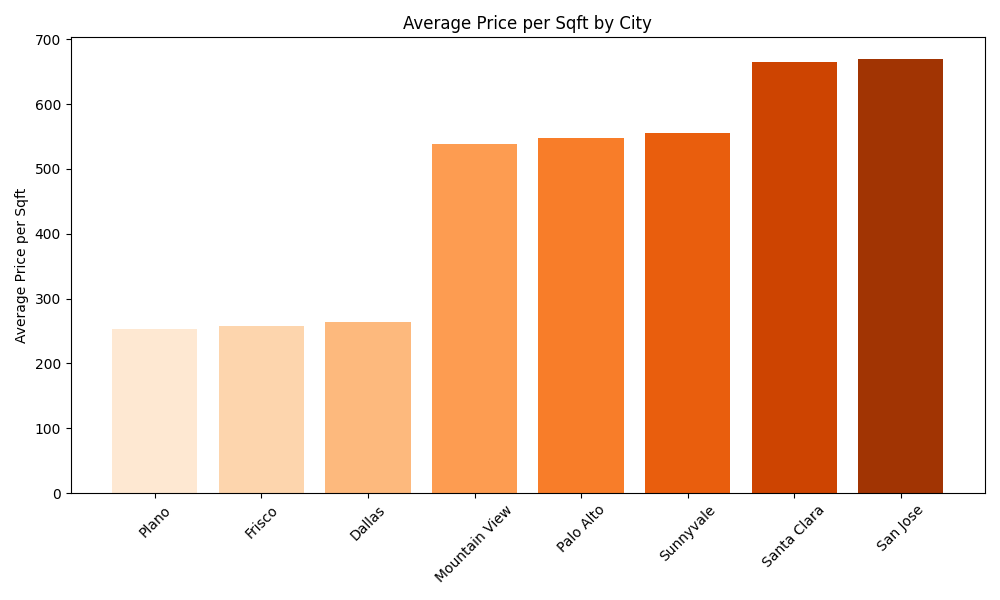
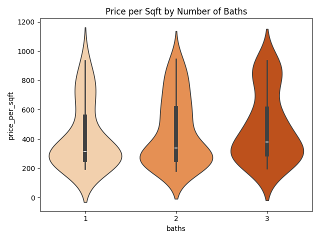

# Snaphomz Trial – Results
**Author:** Yishan Cai  
**Dataset:** 160 property listings  
**Target:** Price per square foot (`price_per_sqft`)

---

## Key EDA Insights
- **Geography drives price**: California cities (Palo Alto, Santa Clara) have 2-3x higher $/sqft than Texas cities (Dallas, Frisco).  
- **Bathrooms matter**: More bathrooms correlate with higher $/sqft; 3-bath homes highest median ~$400-500/sqft.  
- **Bedrooms less impactful**: 2–5 beds show similar median ~$300-400/sqft.

---

## Visuals
### 1. Average Price per Sqft by City

### 2. Price per Sqft by Number of Bathrooms

---

## Predictive Model Performance
- **Model:** Random Forest Regressor
- **Metrics:** RMSE = $164.49/sqft, MAE = $119.86/sqft, R2 = 0.506
- **Takeaway:** Baseline model explains ~50% of variance; reasonable given small dataset (160 rows).

---

## Sample RAG Q&A Output
- **Q:** Does 960 Cedar Ct have a two-car garage?
- **A:** Yes, 960 Cedar Ct, Frisco, TX has two-car garage.
  Supporting evidence: quiet cul-de-sac, two-car garage, near good schools, vaulted ceilings, updated kitchen, HOA includes pool

- **Q:** 960 Cedar Ct - is there a pool?
- **A:** Yes, 960 Cedar Ct, Frisco, TX has pool.
  Supporting evidence: quiet cul-de-sac, two-car garage, near good schools, vaulted ceilings, updated kitchen, HOA includes pool

- **Q:** I'm interested in 960 Cedar Ct. Does it have good schools nearby?
- **A:** Yes, 960 Cedar Ct, Frisco, TX has good schools.
  Supporting evidence: quiet cul-de-sac, two-car garage, near good schools, vaulted ceilings, updated kitchen, HOA includes pool

---

## Notes / Limitations
- Small dataset limits model complexity and predictive performance.  
- RAG Q&A only covers features explicitly present in `remarks`; flexible reasoning not implemented.
